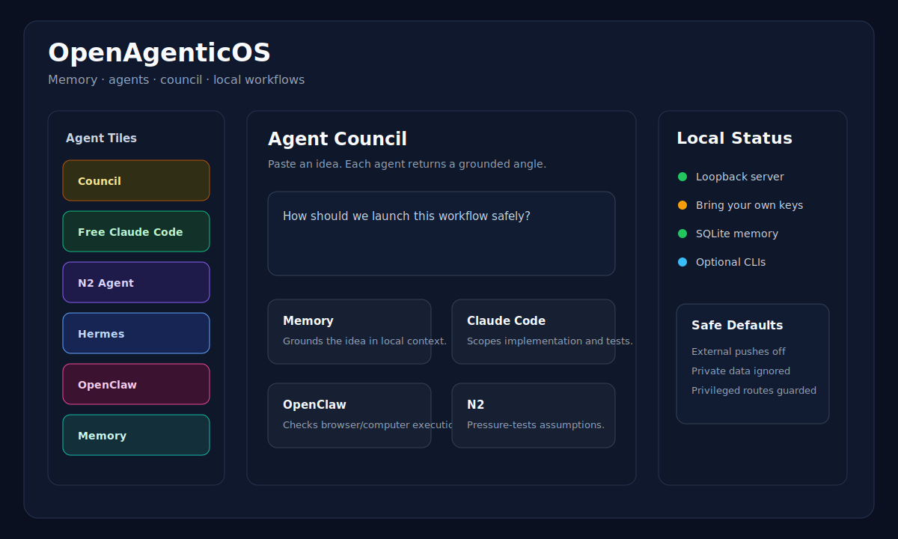

# OpenAgenticOS

A local-first agent operating dashboard for memory, tool status, council deliberation, and optional GTM workflow examples.

It is built as a zero-dependency Node/SQLite app with a vanilla JavaScript dashboard. The app is designed to run on your machine, keep data local by default, and expose honest setup states for optional agent tools.



## What It Includes

- **Agent OS dashboard** with separate tiles for Memory, Free Claude Code, Hermes, OpenClaw, N2, and other optional tools.
- **Agent Council** where you paste an idea and get grounded lenses plus a synthesis.
- **Memory map** built from local account/contact/signal context.
- **Optional operator workspace** for accounts, contacts, signals, scoring, tasks, exports, and call queue examples.
- **CSV-first exports** for bring-your-own CRM/sequencing workflows.
- **Chrome side panel/call cockpit example** assets in `extension/`.
- **Safe defaults**: external pushes are off unless explicitly enabled.

## Requirements

- macOS, Linux, or another environment with Node.js 22+
- No npm dependencies are required
- Optional: OpenRouter key for the live N2/Council route
- Optional: local tools such as Claude Code, Hermes, OpenClaw, Ollama

The app uses Node's experimental SQLite support, so commands include `--experimental-sqlite`.

## Quick Start

```sh
git clone <your-repo-url>
cd OpenAgenticOS
npm run bootstrap
npm start
```

Open:

```text
http://127.0.0.1:4100
```

Agent OS:

```text
http://127.0.0.1:4100/#/agent-os/council
```

## Demo Data

Run:

```sh
npm run seed:demo
```

This creates a disposable demo database at:

```text
data/cockpit-demo.db
```

To launch against that demo DB:

```sh
DATABASE_URL=sqlite:./data/cockpit-demo.db npm start
```

Your real local database defaults to:

```text
data/gtm.db
```

Databases, exports, logs, provider keys, and local tool state are ignored by git.

## Agent OS Setup

The dashboard works without any agent tools installed. Each tile reports either a live surface or an honest setup state.

Optional surfaces:

- **Memory**: local SQLite graph and dashboard memory.
- **Free Claude Code**: detected from the local `claude` CLI.
- **Hermes**: detected from local dashboard ports.
- **OpenClaw**: detected through `openclaw gateway status`, including tailnet-only gateways.
- **N2 Agent**: powered by an OpenAI-compatible route such as OpenRouter.

For the live council/N2 route, set:

```env
OPENROUTER_API_KEY=
OPENROUTER_BASE_URL=https://openrouter.ai/api/v1
N2_MODEL=nex-agi/nex-n2-pro:free
```

The council falls back to local templates when the router is unavailable. If a specific council card has to fall back, its source metadata is labeled honestly.

## Configuration

Copy `.env.example` to `.env` and fill only what you need.

Important flags:

```env
ENABLE_BROWSER_RESEARCH=false
ENABLE_APOLLO_PUSH=false
ENABLE_AMPLEMARKET_PUSH=false
```

Keep these off for local-only use. The app is designed to prepare data and exports without pushing externally unless you explicitly opt in.

Network defaults:

```env
HOST=127.0.0.1
OPS_TOKEN=
```

The server binds to loopback by default. If you expose it with `HOST=0.0.0.0`, set a long random `OPS_TOKEN`; privileged local-run endpoints require loopback or `X-Ops-Token`.

## Tests

```sh
npm test
```

Expected current baseline:

```text
77 passing tests
```

## Publishing Safety

Before pushing a fork or public copy, check:

```sh
git status --ignored --short
```

Do not commit:

- `.env`
- `data/*.db`
- `data/backups/`
- `data/exports/`
- `data/provider-keys*.json`
- `logs/`
- `.claude/`

The included `.gitignore` excludes these by default.

## Security

See [SECURITY.md](SECURITY.md). The short version: keep it local by default, do not commit runtime data, and only expose the server on a network when you have set `OPS_TOKEN`.

## Project Layout

```text
src/server.js          HTTP API, static dashboard, Agent OS surface discovery
src/dashboard/         Vanilla JS/CSS dashboard
src/models.js          SQLite model helpers
src/research/          Example research adapters and fallback logic
src/providers/         Optional provider integrations
extension/             Browser side panel/call cockpit example
sample-data/           Safe sample CSVs and demo inputs
scripts/               Demo seed and smoke scripts
test/                  Node test suite
```

## License

MIT. See [LICENSE](LICENSE).
